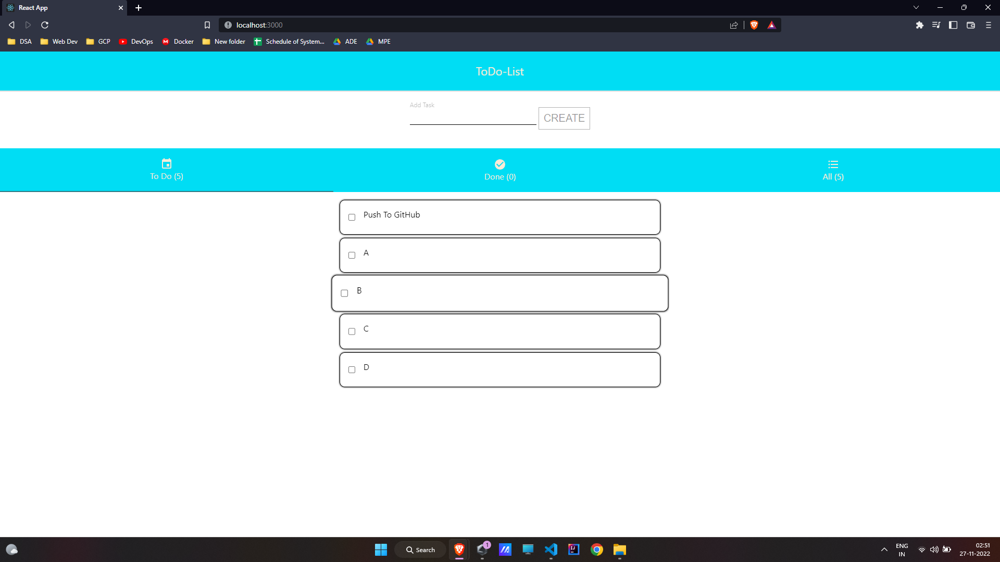

# To-Do List Creater App

This app is created using ReactJS v18.2.0. 
React-Context-API is used to store todo list tasks. 
Material UI is used for icons.

Link to app -> [https://todo-list-csz5905o3-ranadherya.vercel.app/](https://todo-list-csz5905o3-ranadherya.vercel.app/)

## Functionality
  1. New Tasks can be added.
  2. Tasks can be marked done by clicking on them.
  3. Done Tasks can be marksed undone by clicking on them.
  4. All tasks can be seen.
  5. Done Tasks can be cleared from list.

## Screenshots

